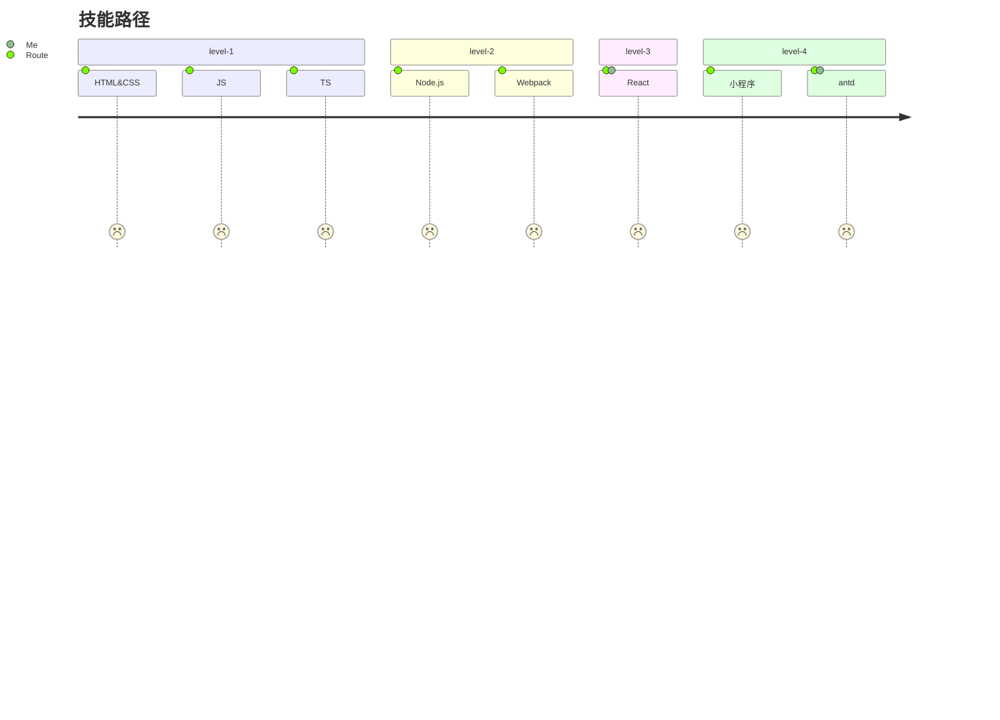

## 后端研发（合伙人）

**Q：开发部门的人员大概是多少？**
> 刚刚起步的项目需要维护，后端研发目前0人，后续还会持续招。\
> 前端有自由职业支持，现在在招前端。

**Q：项目已经上线了吗？**
> 项目进度80%， 外包的项目测试下来还有些问题。

**Q：把这些遗留的问题处理完之后开发这边的方向是什么？**
> 后端研发的方向 持续走技术路线到架构路线去，具体到什么层度还得看公司的发展和一起成长的层度。\
> 基础功能接入后，后续功能会考虑接入AI（智能食谱、自动化排课、根据个人训练数据智能生成训练计划...），研发部目标就是持续学习新的东西然后优化项目。

**Q：岗位的需求？**
> 1. 对 SAAS多租户、支付、微信小程序的接口、这些要有涉及。 
> 2. 后面的话要对项目的数据库、接口设计进行优化。 
> 3. 项目编码规范的学习和代码优化。
> 4. Linux，Docker。 代码部署。
> 5. 菜单角色。

**Q：薪资体系？**
> 固定薪资，每年会根据个人/团队完成的绩效从总利润的`10%～20%`中去发放奖金。

**Q：公积金的缴纳基数？**
> 公积金刚开始是`5%`，后面业绩好了以后会按照季度进行评估。

**Q：试用期工资、时长？**
> 时长 `2个月` ，试用期工资为正式工资的 `80%` 。

**Q：合同签署方式？**
> 腾讯电子签。\
> 提供：身份证复印件，备注用处：`仅限签署劳动合同使用`。

**Q：合伙人模式？**
> 将给初始员工进行期权激励，具体期权份额在 `5%～8%`，发放方式将以渐进方式进行；目的让研发部门能作为公司的合伙人去一起进步。

**Q：入职时间？**
> 尽快。

**Q：公司目标？**
>我司目前刚刚起步，目标是创建一套好用的SAAS服务平台（第一阶段的功能是课程预约，会员管理），
>初始目标是能服务好10,000户小商户，让小商户用上新技术；所以我们公司的研发要有对新技术的渴望和持续学习的动力。

**Q：为什么做这个项目呢？**
>课程管理类的SAAS平台，后期如果商户入驻多了数据起来了以后，根据不同行业（语言培训，健身、瑜伽..）这些垂直类的用户，
>可以通过AI训练与之挂钩的一些功能（AI排课表、根据用户的身体参数AI生成餐饮食谱、训练计划），后面还是有很多可以扩展的功能；而且用户垂直的好处之一可以入驻很多垂直卖点。

**Q: 请问一下公司现在都有那些成员**
> 1. 目前公司刚刚开始，后端研发目前是没人需要招1人（项目已经通过外包完成差不多）。
> 2. 小程序端目前有一个全职自由职业在合作维护 -- 前端。
> 3. 后端web研发有一个全职自由职业在维护 -- 前端。

**Q： 入职信息？**
> 1. 试用期：2M；试用期工资：正式工资 X 80%
> 2. 包含`五险一金`；公积金刚开始是`5%`，后面业绩好了以后会按照季度进行评估。
> 3. 上班形式：办公室办公、远程办公。
> 4. 上班时间：5天/周；9:00～18:00

我们公司目前最多给10K和6%的期权哈；目前需要一个起始后端合伙人（有过SAAS行业的经验）；看您的工作年限，我们目前能力内可以提供给的工资估计是满足不了您的需求，但是如果可以和我们一起成长我们也是欢迎的

```
需求文档：
https://r38ysl28he.feishu.cn/docx/PypjdMl71o8guSxRgwvce8CNnmc?from=from_copylink   
密码：48h28&73

低保真：
https://lanhuapp.com/link/#/invite?sid=qx0deXyV
密码: PW85

可以，你先就这需求文档看下代码，重点关注（课程、会员、场馆）
```

## 前端研发（合伙人）

```
低代码平台的内核开发
低代码平台的易用性规划
人员的招聘与培训
熟悉使用 nuxt 框架开发利于 SEO 的服务端项目
熟练使用 etherjs，web3js 库对合约进行交互
- rem.js
- 配合 CSS3 的 transition 和 animation 实现页面滚动和触摸时候的交互效果
- 使用 Chrome Network 分析各个资源的加载情况，使用 Chrome Lighthouse 工具去跑整个网站，发现存在的问题，并优化问题。
```

```
- 研究业界最新技术，解决创新研发过程中的关键问题和技术难点，维护项目后续维护与升级
```

### 面试内容

```
岗位职责：
- 参与公司相关程序/产品的设计、代码实现、质量测试、升级维护工作；
- 必须按质按量完成甲方正常安排的生产(工作)任务。
- 配合团队完成项目的开发目标。
- 解决项目中的技术问题、持续优化项目；提升用户体验。

任职要求：
- 熟练使用 react 脚手架 、 react 、 Redux 、 react-redux 、react-router-dom 进行开发。
- 熟练使用 antd Pro（Umi、Dva、Hooks） 、 Iconfont 、 Animate 、 ECharts等 UI 库。
- 熟练运用 TypeScript 技术，熟练使用 Git 版本管理工具。
- 熟练小程序、了解 Taro。

岗位福利：
- 五险一金、起始合伙期权。
```

```
嗨， 我们公司刚刚起步，目前是项目完成(包给外包)，目前想要一个全职的后端技术合伙人一起把公司的产品维护起来和开发新功能。但是目前因为刚刚起步所以工资最多的只能给到10K+6%的期权（这里期权最早今年年底可以参入利润分红），
如果您是对创业感兴趣的，可以共同学习进步的可以和我聊一聊；该职位以内或以外的都欢迎。


大冲商务中心C座2306

这里目前是我们家里的英语培训机构（SJ English），你要习惯在办公室办公的话可以用里面的办公室。
因为我喜欢户外、咖啡店办公（当然也是节约成本），所以自己就没有租办公室；
后期可以支持远程办公（家里、咖啡店），除非需要一起开会才会在办公室一起。

```

### 技能点



1. 我们公司的目前刚刚起步，目标是创建一套丝滑好用的SAAS服务平台（第一阶段的功能是课程预约，会员管理），目标是能服务好一万家商户，让小人物用上新技术；所以我们公司的研发要有对新技术的渴望和持续学习的动力。
2. 技术合伙人可以获得公司期权。
3. 前期： 
	- 公司需要一个后端研发， 所以任务比较重。


## 股权激励

### 员工配股

```
期权？
下一个行业蓝海， 流量的杠杆，
新的行业、新的趋势。
AI行业、区块链。

免费提供项目给朋友，帮朋友解决问题。然后获取项目提成。
在力所能及的范围内，帮别人解决问题。
```


## 数据库

- [MySql8.3](https://mp.weixin.qq.com/s/uLjgKVHVyDuAIQSZNkAnWA)


