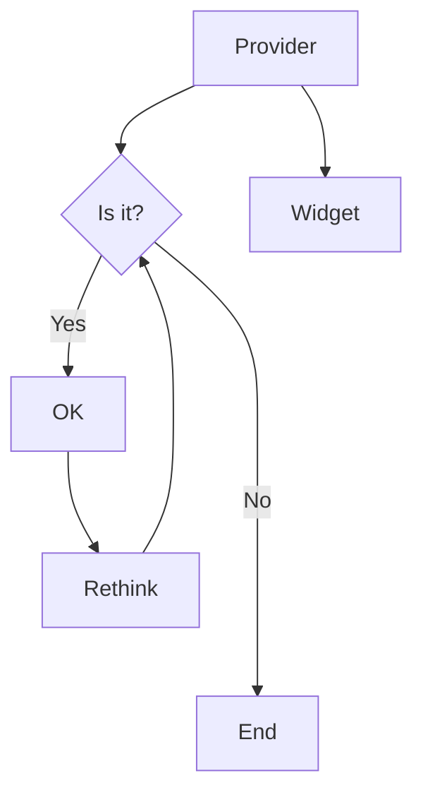
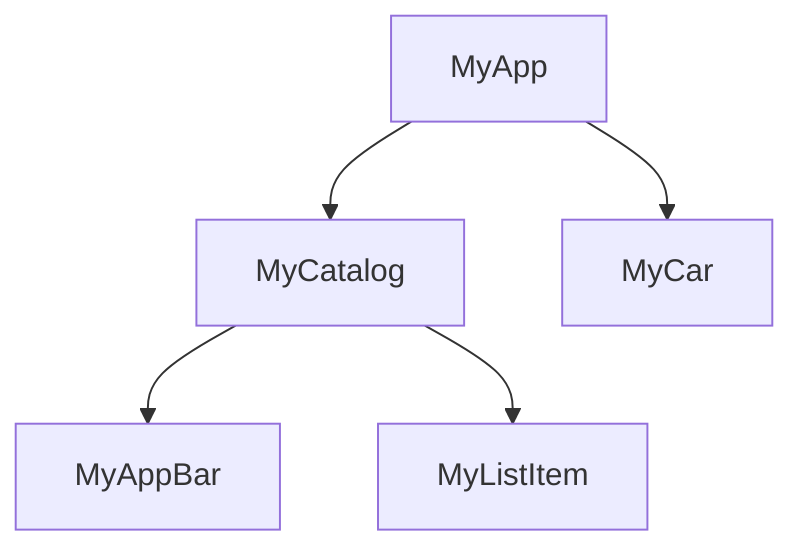

# provider

[mermaid](https://mermaid.js.org/syntax/flowchart.html)

```mermaid
flowchart TD
    A[Provider] --> B{Is it?}
    B -->|Yes| C[OK]
    C --> D[Rethink]
    D --> B
    A --> F[Widget]
    B ---->|No| E[End]
```

```mermaid
flowchart TD
    A[MyApp] --> B[MyCatalog]
    A --> C[MyCar]
    B --> D[MyAppBar]
    B --> F[MyListItem]
```