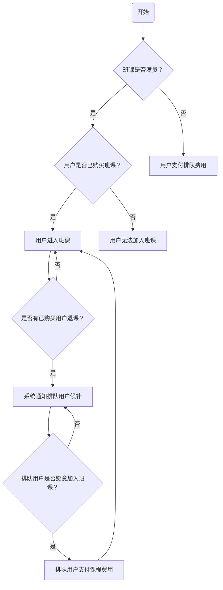
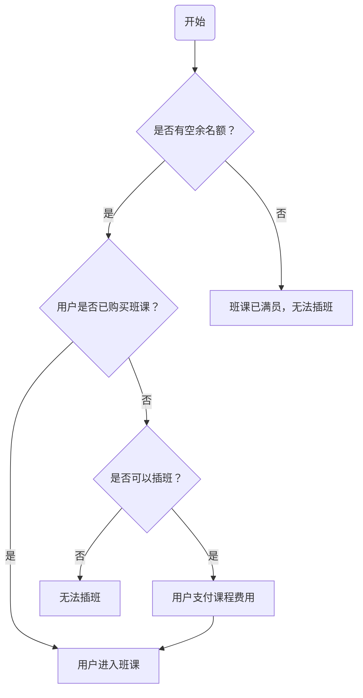

# 班课

## Q&A

### 老师在哪？

在班课系统中，设置主讲教师的功能通常会在课程中进行设置。主讲教师是指负责教授该门课程的主要教师，
他/她负责教学内容的设计、课堂教学和学生评估等任务。因此，将设置主讲教师的功能放置在课程管理中是最为合适的。具体来说：

1. **课程管理中设置：**
   - 在创建或编辑课程时，通常会提供设置主讲教师的选项或字段。
   - 教师在课程管理界面可以指定主讲教师，以确保在课程表中显示出主讲教师的信息，方便学生和其他相关人员了解和识别。

2. **关联到班级：**
   - 课程通常会关联到班级中，但是设置主讲教师的功能仍然应该放置在课程管理中。
   - 一旦主讲教师在课程管理中设置完成，他/她的信息会自动关联到相应的班级中，以便在班级页面或课程表中显示主讲教师的信息。

3. **课程表中的显示：**
   - 课程表中会显示每门课程的主讲教师信息，确保学生和其他相关人员可以在课程表中清晰地了解到每门课程的主要负责人。
   - 课程表中的主讲教师信息应该与课程管理中设置的一致，以确保信息的一致性和准确性。

综上所述，设置主讲教师的功能应该放置在课程管理中，以确保教师可以方便地管理和调整自己所负责的课程信息，并确保课程表中显示的主讲教师信息准确可靠。


### 代课老师课时费？

计算代课老师的课时费需要考虑几个因素，包括代课老师的工作时间、教学任务以及与主讲教师的薪酬政策等。以下是一种可能的计算方式：

1. **基础计算公式：**
   - 代课老师的课时费可以基于工作时间和工作量进行计算，通常采用以下公式：
     ```
     课时费 = 每课时单价 × 授课时间
     ```
   - 其中，“每课时单价”是代课老师的时薪或课时费率，“授课时间”是代课老师实际上课的时间。

2. **课时费率设定：**
   - 每课时单价可以根据代课老师的资历、经验、教学能力以及市场行情等因素进行确定。
   - 可以参考主讲教师的薪酬水平，适当调整代课老师的课时费率。

3. **实际授课时间：**
   - 代课老师的课时费应该根据实际授课时间进行计算，而非全天倒班的时间。
   - 需要准确记录每次代课的开始时间和结束时间，以确保计算的准确性。

4. **其他考虑因素：**
   - 如果代课老师需要进行额外的备课时间，可以根据备课时间另行计费。
   - 可以考虑是否需要给予代课老师额外的奖励或补贴，以鼓励其积极参与代课工作。

5. **系统支持：**
   - 班课系统可以设置一个专门的模块或功能来管理代课老师的课时费计算，提供灵活的设置选项，以适应不同的计费需求和情况。

通过以上方式，可以根据代课老师的实际工作时间和工作量来合理计算其课时费，保证其获得应有的报酬，同时也能够有效控制成本。

**在班课系统中，课程开始时间、课程结束时间和总课时这些字段通常在课程管理中进行设置。具体来说：**

1. **课程开始时间和结束时间：**
   - 在创建或编辑课程时，通常会提供字段用于设置课程的开始时间和结束时间。
   - 教师或管理员可以在课程管理界面中，填写或选择课程的开始时间和结束时间，以便学生和教师了解课程的时间范围。

2. **总课时：**
   - 总课时通常是指整个课程的总共授课时间，可以是小时数或者课时数。
   - 在创建或编辑课程时，也会提供一个字段用于设置课程的总课时。
   - 教师或管理员可以根据课程的实际情况填写总课时，以便学生和教师了解课程的学习时间安排。

这些字段的设置通常都在课程管理界面中进行，以确保课程的时间信息可以清晰地呈现给学生和教师，方便他们了解和安排自己的学习或教学计划。


### 排队逻辑

针对这个需求，可以设计以下流程：

1. **满员排队功能：**
   - 当班课已满员时，系统应该提供一个排队功能，允许没有购买班课的用户支付一定的金额进行排队。
   - 用户可以在班课详情页或购买页面上选择排队选项，系统会引导用户支付排队费用，并将其加入排队列表中。

2. **排队优先原则：**
   - 当已购买的用户退课时，系统应该按照排队的先后顺序给予排队用户候补资格。
   - 即排在队列前面的用户应该优先候补，确保排队的用户有公平的机会获得课程名额。

3. **排队费用设置：**
   - 管理员可以在后台设置排队所需支付的金额，确保排队费用合理，并根据实际情况进行调整。
   - 排队费用可以根据班课的热度和需求情况进行动态调整，以确保排队功能的有效性和吸引力。

4. **通知排队用户：**
   - 当有已购买用户退课导致名额空出时，系统应该及时通知排队用户，提醒他们有机会候补。
   - 这可以通过站内信、邮件或短信等方式进行通知，确保排队用户能够及时了解到候补机会。

5. **自动候补流程：**
   - 当已购买用户退课后，系统应该自动将排在队列前面的排队用户转换为正式购买用户。
   - 这样可以确保候补流程的顺畅进行，提高用户体验和满意度。

通过以上设计，可以实现在满员情况下允许用户进行排队，并且在有名额空出时，优先候补排在队列前面的用户，确保排队用户有机会获得班课名额。

以下是使用Mermaid语法描述的排队流程图：



上述流程图描述了排队的整个流程：

1. 开始后，系统检查班课是否已满员。
2. 如果班课已满员，则系统检查用户是否已经购买班课。
3. 如果用户已购买班课，则用户无法加入班课，流程结束。
4. 如果用户未购买班课，则用户支付排队费用后进入排队列表。
5. 已购买用户退课时，系统通知排队用户候补。
6. 排队用户选择是否愿意加入班课，愿意则支付课程费用后加入班课，否则继续等待。

### 可插班

理解您的需求，下面是关于"可插班"状态的推测和业务流程的Mermaid流程图描述：



上述流程图描述了可插班状态下的业务流程：

1. 开始后，系统检查是否有空余名额。
2. 如果有空余名额，则系统检查用户是否已经购买班课。
3. 如果用户已购买班课，则用户进入班课，流程结束。
4. 如果用户未购买班课，则系统判断是否可以插班。
5. 如果可以插班，则用户支付课程费用后进入班课，流程结束。
6. 如果无法插班，则用户无法加入班课，流程结束。

## 班课提醒

针对课程表中进行重复性排课的情况，一次性排了两周的课程，可以通过以下方式提醒用户：

1. **日历应用提醒：**
   - 将重复性排课同步到用户的日历应用中，如 Google 日历、Outlook 等。
   - 用户在日历应用中会看到每周的课程安排，并根据其设置的提醒规则，在每次课程开始前收到提醒通知。

2. **短信/邮件提醒：**
   - 在每周课程开始前，系统可以自动发送短信或邮件提醒给用户。
   - 这些提醒可以包括课程时间、地点等信息，提醒用户及时参加课程。

3. **站内消息通知：**
   - 在系统内部设置消息通知功能，系统可以在每周课程开始前向用户发送站内消息提醒。
   - 用户登录系统后，可以在消息中心或通知栏中查看到即将开始的课程提醒。

4. **移动应用推送通知：**
   - 如果有移动应用，可以通过推送通知的方式提醒用户每周课程的开始。
   - 系统在每次课程开始前发送推送通知给用户，提醒他们及时参加课程。

5. **课程提醒页面：**
   - 在系统中设立一个课程提醒页面，用户可以在该页面查看到接下来两周的课程安排。
   - 系统可以在该页面显示课程时间、地点等详细信息，并提醒用户即将开始的课程。

通过以上方式，用户可以及时了解到每周课程的安排，确保不会错过重复性排课的课程。


## 班级